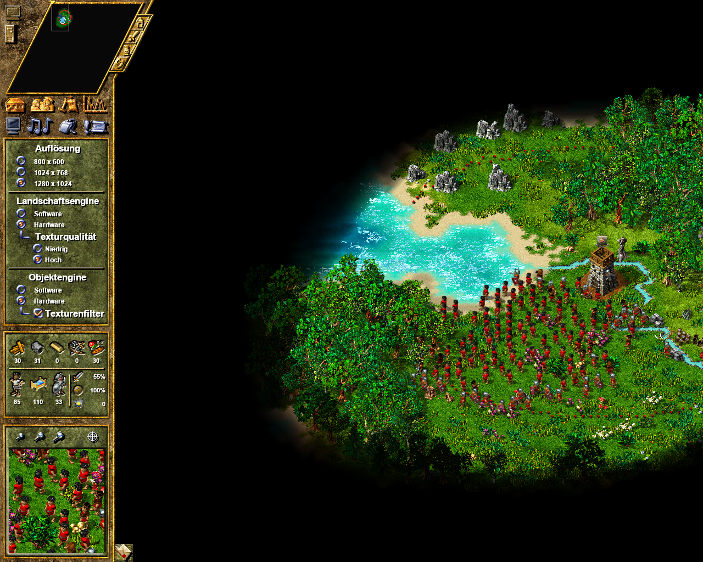
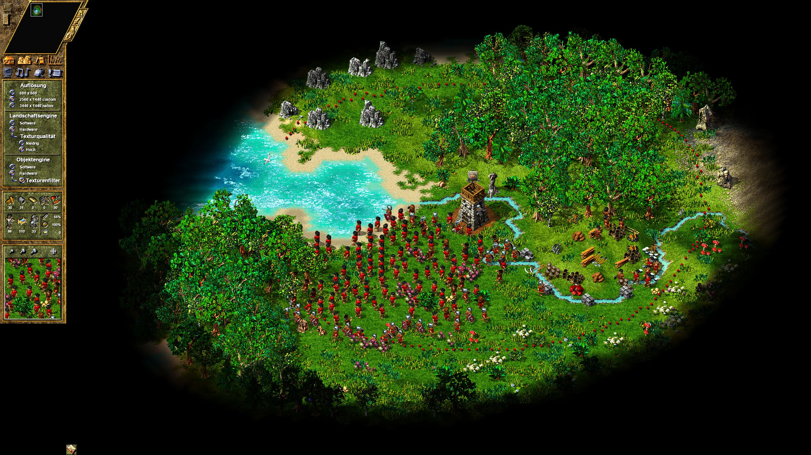
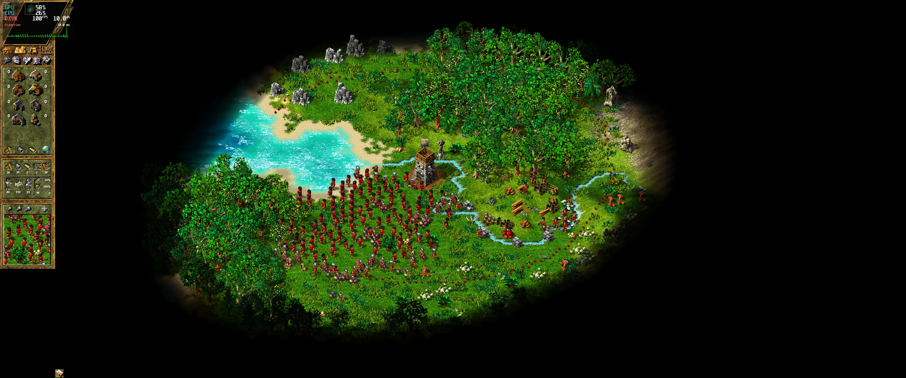

# Settlers IV Widescreen Fix
Proper Widescreen Fix for Settlers IV Gold Edition.

Yes I am aware that [Settlers4-Widescreen-Tool](https://github.com/FireEmerald/Settlers4-Widescreen-Tool) by [FireEmerald](https://github.com/FireEmerald) exists, but it has a few limitations which I managed to fix.
The two most important being:

- resolutions are not limited to a fixed list, you can use whatever the heck you want
- resolution does not get fucked up, when changing graphics options like texture quality or texture filterings

I also found a way to make the custom resolutions show in the in game GUI of the resolution selector.

## Installation

- download patch archive from [releases](https://github.com/zocker-160/Settlers-IV-Patches/releases)
- unpack it
- copy the files into the `Exe` folder where the `S4_Main.exe` is
- (optional) edit the .ini file as you desire

## Supported Versions

**ONLY** The Settlers IV Gold Edition from GOG is supported!
- `S4.exe` SHA256 `edf54528e2bb9e5c757918f44026c1edb3f092abc9af0957a2cc2330971a17bb`
- `S4_Main.exe` SHA256 `4b1670e105a2e75da73f6248d8ac88264543c5480b3fa19066a3d61d95ce29b1`

## Showcase
### Original

### Patched

